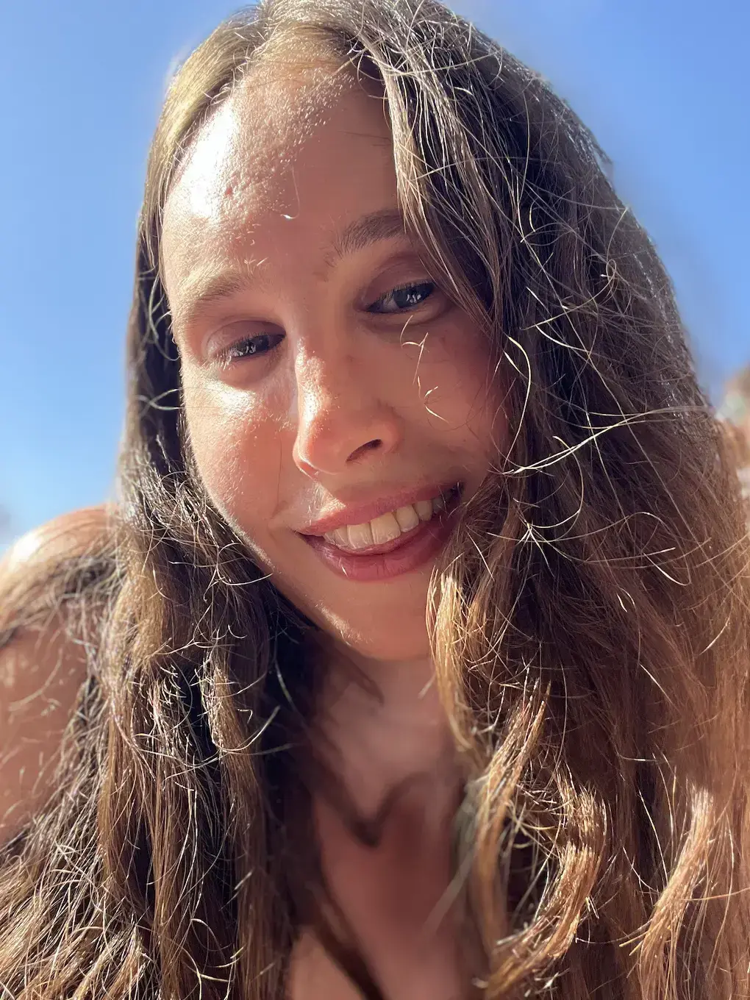

## En Bref
- **Maelis**, parfois appelée kissmaelis
- **30 ans** d’instants vécus
- **1m80**, silhouette longue, **70 kg** de présence
- **Femme trans post-op**, pleinement incarnée, à l’aise dans sa féminité
- **Petits seins naturels**, délicats et spontanés
- **Joyeuse par nature**, doucement espiègle, un peu coquine quand l’envie se fait sentir

## En détails

### Une présence

Je m’appelle Maelis Gast, aussi connue sous le pseudonyme kissmaelis. J’ai 27 ans et je vis à Paris. On me reconnaît d’abord à mon sourire, celui qui arrive avant les mots et à cette joie tranquille qui éclaire les rencontres.

Je suis une femme douce et solaire, d’un calme qui rassure. Et puis, parfois, lorsque le jeu s’invite, une espièglerie légère affleure, comme une étincelle. J’aime les ambiances vivantes et rieuses, les instants où l’on se sent libre d’être soi, tout en sachant ralentir, respirer, prendre le temps quand il devient précieux.

### Sensualité et complicité

Je me sens pleinement à l’aise dans mon corps. La sensualité, pour moi, est une langue silencieuse : regards qui s’attardent, gestes qui se répondent, tension qui monte doucement jusqu’à dissoudre le reste du monde. J’aime quand les choses se construisent avec délicatesse, quand le désir naît de l’écoute, du respect et des petites attentions.

### Les plaisirs simples

J’ai un goût particulier pour les plaisirs simples et profonds : partager un bon repas, découvrir un film de niche, me perdre dans des conversations qui parlent de la vie, du temps, de ce qui nous traverse. J’aime être surprise, déplacée doucement hors des cadres, invitée à l’inattendu.

### Féminité

Ma féminité est naturelle, sans mise en scène excessive. Je me sens libre, apaisée, alignée. J’ai un tatouage qui m’est cher, il raconte quelque chose de moi, mais ne se livre pas à tout le monde. J’aime être regardée avec tendresse, désir et respect, cette combinaison rare qui rend les rencontres mémorables.

### Parcours

Mon histoire est faite de détours et de choix courageux. J’ai grandi à la campagne, dans un environnement modeste et isolé, avant de trouver la force de partir. Paris a été un refuge, un point d’ancrage. J’y ai étudié l’ingénierie, travaillé plusieurs années comme développeuse, notamment aux Pays-Bas où j’ai appris le néerlandais. Puis est venue ma transition : une période de bouleversement, de vérité, qui m’a amenée à quitter une vie déjà tracée pour prendre soin de moi et me rapprocher de ce que je désirais réellement.

Aujourd’hui, je travaille à temps partiel dans la santé communautaire et je mène cette activité en parallèle, comme une extension naturelle de mon rapport aux autres. Je suis une femme trans, simplement, factuellement, en paix avec cela.

### Curiosité

Dans mon quotidien, je suis curieuse de tout : passer du temps avec mes amis, regarder des films loufoques, fréquenter des espaces sex-positifs ou BDSM, rencontrer des âmes singulières, errer dans Paris sans destination, rêver, apprendre mille choses inutiles, créer avec mes mains : collages, peinture, dessin.

### Désirs et projets

Mes projets sont personnels et artistiques. J’ai envie de vivre selon mes élans, de créer du contenu sexy et sensible, de raconter des fragments de mon histoire, d’explorer des idées parfois étranges, parfois légères. J’ai besoin de diversité, de liberté, de mouvement.

### Ce que j’aimerais que tu ressentes

Si tu me lis encore, j’aimerais que tu ressentes une proximité douce, une curiosité tranquille, un désir calme. J’aime les rencontres qui prennent le temps, celles qui s’inscrivent dans la continuité et la complicité.

    <a href="/fr/rencontre" class="button" data-button-variant="primary">Peut-être que tout commence ici.</a>

